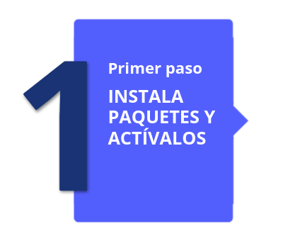
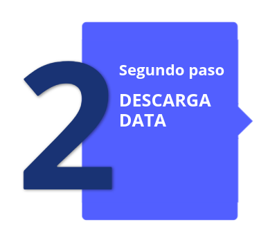
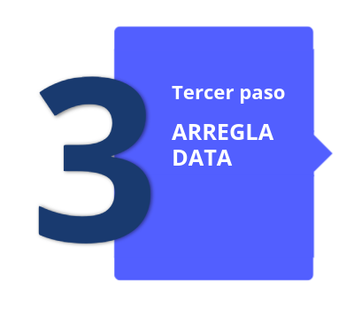
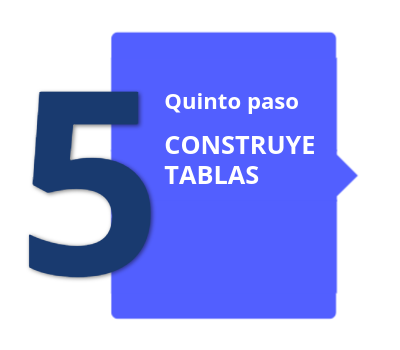
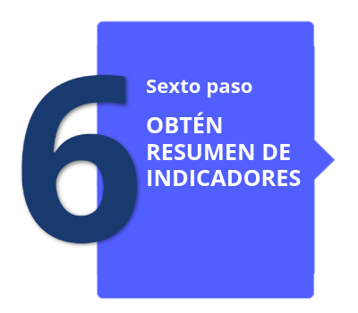
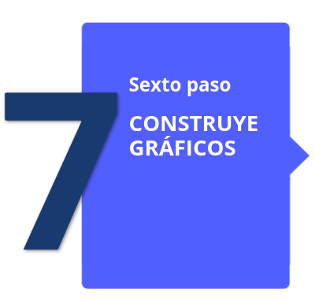
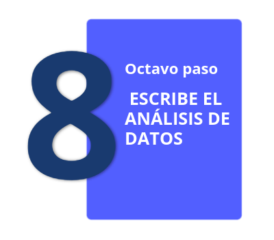

<br/><br/>

Sigue las siguientes instrucciones y podrás realizar un análisis de la situación actual del Covid-19 para la región de tu preferencia.

Debes entregar un archivo pdf con el resultado del proceso 

<br/><br/>

```{r setup, include=FALSE}
knitr::opts_chunk$set(echo = TRUE)
```

```{r, echo=FALSE, out.width="20%", fig.align='left'}

```

```{r, eval=FALSE}
install.packages("tidyverse") #  instalacion de paquete para manejo de datos
install.packages("RSocrata", dependencies = TRUE)   # instalación de paquete RSocrata
install.packages("devtools") 
devtools::install_github("dcomtois/summarytools")
library(tidyverse)   # libreria de librerias util en el manejo de datos
library(RSocrata)    # llamado de libreria
```

<br/><br/>

```{r, echo=FALSE, out.width="20%", fig.align='left'}

```

```{r, eval=FALSE}
token <- "zxMsD6eXc0zlEMryRGW87Hwrz"  # token
Colombia <- read.socrata("https://www.datos.gov.co/resource/gt2j-8ykr.json", app_token = token) # lectura de manera remota 

```

<br/><br/>

```{r, echo=FALSE, out.width="20%", fig.align='left'}

```

```{r, eval=FALSE}
Colombia$edad=as.integer(Colombia$edad)  # convertir en entrro la variable edad
Colombia$sexo=str_to_lower(Colombia$sexo) # pasar a minusculas todos valores de la variable sexo
Colombia$estado=str_to_lower(Colombia$estado) # pasar a minusculas todos lo valores de la variable estado
Colombia$estado[Colombia$estado=="n/a"]=NA   # cambiar el valor  n/a por NA - valores faltantes
Colombia$recuperado=str_to_lower(Colombia$recuperado) # pasar a minusculas todos los valores de la variable recuperado
Colombia$recuperado[Colombia$recuperado=="n/a"]=NA 
Colombia$ubicacion=str_to_lower(Colombia$ubicacion) # pasar a minusculas todos los valores de la variable ubicacion
Colombia$ubicacion[Colombia$ubicacion=="n/a"]=NA 
```

<br/><br/>

```{r, echo=FALSE, out.width="20%", fig.align='left'}

```

```{r, eval=FALSE}
Colombia22=subset(Colombia, Colombia$fecha_reporte_web>="2022-01-01") # data del 2022
Colombia21=subset(Colombia, Colombia$fecha_reporte_web>="2021-01-01" & Colombia$fecha_reporte_web<"2022-01-01") # data de 2021
Colombia20=subset(Colombia, Colombia$fecha_reporte_web>="2020-01-01" & Colombia$fecha_reporte_web<"2021-01-01") # data de 2020
Colombia22_11=subset(Colombia, Colombia$fecha_reporte_web>="2022-11-01") # data de diciembre 2022 
Valle22_11=subset(Colombia22_11, departamento=="76") # data del valle del cauca de 2022
Cali22_11= subset(Colombia22_11, ciudad_municipio_nom=="CALI") # data de cali de 2022

```

<br/><br/>

```{r, echo=FALSE, out.width="20%", fig.align='left'}

```

```{r, eval=FALSE}
table(Colombia22$estado)
table(Colombia21$estado)
table(Colombia20$estado)
table(Valle22_11$estado)
table(Cali22_11$estado, Cali22_11$sexo)

summarytools::freq(Colombia22$estado, cumul = F)
summarytools::freq(Colombia21$estado, cumul = F)
summarytools::freq(Colombia20$estado, cumul = F)
```

<br/><br/>

```{r, echo=FALSE, out.width="20%", fig.align='left'}

```

```{r, eval=FALSE}
mean(Colombia22_11$edad, na.rm = FALSE)
median(Colombia22_11$edad)
var(Colombia22_11$edad)
sd(Colombia22_11$edad)
min(Colombia22_11$edad)
max(Colombia22_11$edad)

summarytools::descr(Colombia22_11$edad)
```

<br/><br/>

```{r, echo=FALSE, out.width="18%", fig.align='left'}

```

```{r, eval=FALSE}
t1=table(Colombia$sexo)
pie(t1)

t2=table(Colombia$sexo,Colombia$ubicacion)
barplot(t2, las=1)

hist(Colombia22_11$edad, las=1, xlab = "edad (años)", ylab = "frecuencia", 
     main = "Edad de personas contagiadas Covid19 Colombia- Nov 2022" )

boxplot(Colombia$edad, horizontal = TRUE,
        main = "Edad de personas contagiadas Covid19 Colombia")


```

<br/><br/>

```{r, echo=FALSE, out.width="20%", fig.align='left'}

```

```{r, eval=FALSE}
Finalmente realiza un análisis de los resultados obtenidos
```

