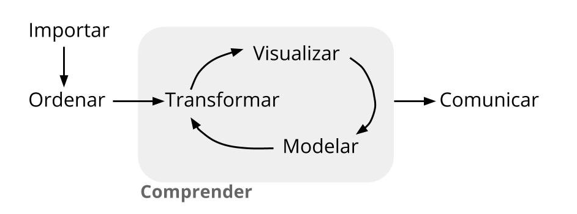

```{r setup, include=FALSE}
knitr::opts_chunk$set(echo = TRUE, comment = NA)

library(summarytools)
x=c(51.35, 49.88, 49.35, 51.21, 51.24, 45.75, 48.42, 47.29, 48.98, 50.06, 50.94, 45.41, 55.69, 48.90, 56.00, 44.72, 56.89, 46.61, 53.25, 48.46, 49.74, 45.03, 63.02, 50.96, 50.43, 51.19, 53.45, 52.10, 49.61, 45.89, 49.76, 42.30, 53.48, 54.71, 53.48, 56.67, 44.38, 51.18, 51.06, 54.96, 64.44, 51.85, 45.33, 62.74, 43.84, 51.32, 53.70, 51.00, 52.86, 43.06, 43.63, 51.24, 52.84, 49.19, 49.56, 49.56, 51.49, 55.31, 46.74, 47.62, 51.85, 58.90, 50.80, 43.39, 48.54, 52.72, 44.82, 52.49, 58.43, 52.91)
data1 <- data.frame(
  name1=rep("A",70),
  value1=x
)
```


</br>


El proceso de manejo de datos comprende una serie de etapas que permiten cumplir los objetivos trazados en una investigación o proyecto de Ciencia de Datos como lo menciona Antonio Vazquez Brust en su libro Ciencia de Datos para gente sociable. Es necesario para realizar este proceso recordar o incorporar conceptos de Estadística que hacen posible que se realicen las etapas descritas sin inconvenientes.

</br></br>

```{r, echo=FALSE, out.width="60%", fig.align = "center"}

```
<center>Tomado de : [Ciencia de Datos para Gente Sociable](https://bitsandbricks.github.io/ciencia_de_datos_gente_sociable/index.html)</center>


</br></br>

Debemos relacionar los datos con un proposito (objetivos) que nos permita proporner soluciones o metodologías y así plantear recomendaciones a un problema en particular, a partir de información por lo regular estructurada  en una bases de datos  conformada por variables (columnas) y registros (filas)

En número de registros por lo regular de gran tamaño, hace necesaria la utilización de un herramientas computacionales para su analisis y procesamiento (en nuestro caso el lenguaje **R**).

</br></br>

### **Tipos de variables**

</br>

Inicialmente se examinan las caracteristicas de las variables que conforman la data que serán empleadas posteriormente en la generación de modelos.

Las variables se puede clasificar como :

* **Cualitativas** : corresponde a caracteristicas que pueden tomar como valores palabras

* **Cuantitativas** : corresponden a valores numéricos que representan una caracteristica del objeto o individuo observado. A su vez se pueden clasificar como :

  + **Discretas** : se caracteriza por que están relacionadas con el conteo  (número de...) 
  
  + **Continuas** : estas variables se originan en la medición y pueden tomar cualquier valor real  

</br></br>

**Nota** : El termino *variable* en estadística se refiere a una caracteristica de interés que permite una agrupación o analisis a diferencia de la interpretación que se le pueda dar en el área de sistemas, donde son de interés caracteristicas como id, número de cedula, dirección, nombre del representante legal entre otros. En adelante se entenderán como variables las primeras.

</br></br>

### **Tipos de escala**

</br>

A la clasificación anterior añadimos la forma en que se pueden medir las variables, es decir el tipo de escala: 

</br></br>

| Tipo de variable       |    escala de medición    |  ejemplo                            |
|:-----------------------|:-------------------------|:------------------------------------|
| Cualitativa            | nominal (no existe orden)|  estado civil ( soltero, casdado, separado, viodo, unión libre)   | 
| (conteo)               |                          |  color ( blanco, negro, rojo, azul, amarillo, verde)              |
|                        |                          |  pais (co, pe, us, uk, es,..)                                     |
|                        | ordinal (con orden)      | nivel de ansiedad (bajo, medio, alto)                             |
|                        |                          | clima laboral (excelente, muy bueno, bueno, regular, muy regular) |
|                        |                          | nivel de satisfación (baja, media, alta)                          |
| Cuantitativas          | intervalo                | temperatura (centigrados, kelvin, Fahrenheit)                        |
| (medición)             |                          | operacionalización de clima laboral |
|                        | de razón                 | edad                                |
|                        |                          | tiempo de ejeción                   |
|                        |                          | precio del artículo en dólares      |

</br></br></br>

Dependiendo el tipo de variable y su escala de medición se tomaran los respectivos indicadores y gráficos para su correcta simplificación y representación 


|Tipo de variable  | Escala          |  Indicadores             | Gráfico                     |
|:-----------------|:----------------|:-------------------------|:----------------------------|
|Cualitativas      |                 |                          |                             |
|                  |Nominal          | moda                     | diagrama de torta           |
|                  |Ordinal          | moda                     | diagrama de barras          |
|                  |                 |                          | diagrama de mosaico         |
|                  |                 |                          |                             |
|Cuantitativas     |Intervalo-razón  | media                    | diagrama de tallos y hojas  |
|                  |                 | mediana                  | histograma                  |
|                  |                 | mínimo                   | diagrama de cajas           |
|                  |                 | máximo                   | diagrama de densidad        |
|                  |                 | rango                    | diagrama de puntos          |
|                  |                 | varianza                 | diagrama de lineas          |
|                  |                 | desviación estandar      | diagrama de radar           |
|                  |                 | coeficiende de variación | gráfico likert              |
|                  |                 | coeficiente de curtosis  | mapa de calor               |
|                  |                 | coeficiende de asimetria | diagramas de dispersión     |
|                  |                 | percentiles, deciles, cuartiles |                      |
 
</br></br>

En esta unidad se tratará de manera general los conceptos principales relacionados con el analisis descriptivo de datos, basados en las principales caracteristicas de los datos, tanto para variables cualitativas como para variables cuantitativas.

El análisis de las variables cuantitativas se centra en la contrucción de tablas de frecuencia y su prepresentación a traves de gráficos de tortas (nominales) y de barras (ordinales), mientras que en el caso de las variables cualitativas nos centraremos en indicadores de posición,  centro, variabilidad o de dispersión y de forma, además de su representación gráfica mediante histogramas, diagramas de cajas, diagramas de dispersión entre otros. 

</br></br>

### **Resumen de indicadores  y gráfica**

</br>

La función del paquete summarytools : `summarytools::descr(x)` permite obtener un resumen de indicadores. Al aplicar la función a un grupo de 70 valores correspondientes a los tiempo gastados por atletas en recorrer 10.5 kilómetros. 

</br>

```{r}
summarytools::descr(data1$value1)
```
</br></br>

```{r, fig.height=4, echo=FALSE}
library(ggplot2)
dat <- data1
plot <- ggplot(data1, aes(x = value1)) 
plot <- plot + geom_histogram(aes(y=..density..), color="black", fill = "#034A96", binwidth = 5, alpha = 0.5) + labs(title = "Tiempo de carrera  K10.5-2022") + ylab("densidad") + xlab("minutos")
plot
```

Los datos indican que en promedio los atletas emplearon 51 minutos, con un tiempo mínimo para el ganador de 43 minutos y un máximo de 64. Los datos presenta un forma simetrica concentra un gran número de atletas en un rango en tre 45 y 55 minutos. En cuanto su dispersión presentan un 9% de coeficiente de variación que los califica como homogeneos.


