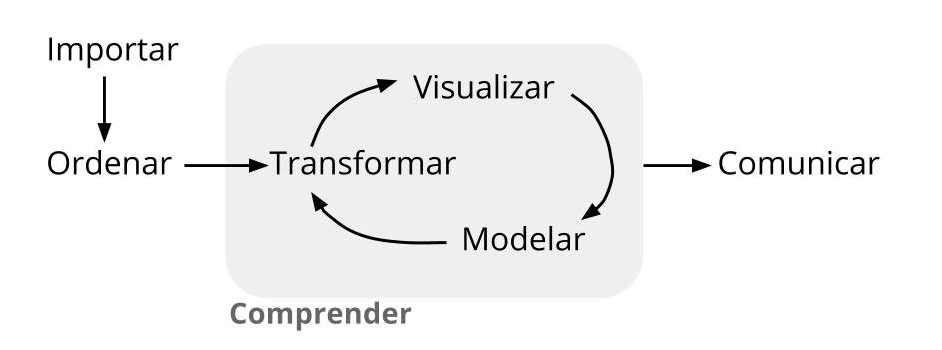

```{r setup, include=FALSE}
knitr::opts_chunk$set(echo = TRUE, comment = NA)
```


</br></br></br>

```{r, echo=FALSE, out.width="60%", fig.align = "center"}

```
<sub>
Tomado de : [Ciencia de Datos para Gente Sociable](https://bitsandbricks.github.io/ciencia_de_datos_gente_sociable/index.html)
</sub>

</br>

El proceso de manejo de datos comprende una serie de etapas que permiten cumplir los objetivos trazados en una investigación o proyecto de Ciencia de datos como lo menciona Antonio Vazquez Brust en su libro Ciencia de Datos para gente sociable. Es necesario para realizar este proceso recordar o incorporar conceptos de Estadística que hacen posible que se realicen las etapas descritas sin inconvenientes.


</br></br>

Es necesario inicialmente relacionar los datos con un propósito (objetivos) que nos permita proponer soluciones o metodologías que permitan plantear recomendaciones a un problema en particular planteado, a partir de información por lo regular estructurada  en una bases de datos  conformada por variables (columnas) y registros (filas)

En número de registros por lo regular de gran tamaño hace necesaria la utilización de un herramientas computacionales para su análisis y procesamiento (en nuestro caso el lenguaje R)


Inicialmente se examinan las características de las variables que conforman la data que serán empleadas posteriormente en la generación de modelos.

Las variables se puede clasificar como :

* Cualitativas : corresponde a características que pueden tomar como valores palabras

* Cuantitativas : corresponden a valores numéricos que representan una característica del objeto o individuo observado. A su vez se pueden clasificar como :

  + Discretas : se caracteriza por que están relacionadas con el conteo  (número de 
  
  + Continuas : estas variables se originan en la medición  

</br></br>

<div class="content-box-gray">
### <span style="color:#686868">**Nota**</span> 

El término **variable** en estadística se refiere a una característica de interés que permite una agrupación o análisis a diferencia de la interpretación que se le pueda dar en el área de sistemas donde es de su interés características como id, número de cédula, dirección, nombre del representante legal entro otros.
</div>

</br></br>

A la clasificación anterior añadimos la forma en que se pueden medir las variables, es decir el tipo de escala: 

</br></br>

| Tipo de variable       |    escala de medición    |  ejemplo                            |
|:-----------------------|:-------------------------|:------------------------------------|
| Cualitativa            | nominal (no existe orden)|  estado civil ( soltero, casdado, separado, viodo, unión libre)   | 
| (conteo)               |                          |  color ( blanco, negro, rojo, azul, amarillo, verde)              |
|                        |                          |  pais (co, pe, us, uk, es,..)                                     |
|                        | ordinal (con orden)      | nivel de ansiedad (bajo, medio, alto)                             |
|                        |                          | clima laboral (excelente, muy bueno, bueno, regular, muy regular) |
|                        |                          | nivel de satisfación (baja, media, alta)                          |
| Cuantitativas          | intervalo                | temperatura (centigrados, kelvin, Fahrenheit)                        |
| (medición)             |                          | operacionalización de clima laboral |
|                        | de razón                 | edad                                |
|                        |                          | tiempo de ejeción                   |
|                        |                          | precio del artículo en dólares      |

</br></br></br>

Dependiendo el tipo de variable y su escala de medición se tomaran los respectivos indicadores y gráficos para su correcta simplificación y representación 


|Tipo de variable  | Escala          |  Indicadores             | Gráfico                     |
|:-----------------|:----------------|:-------------------------|:----------------------------|
|Cualitativas      |                 |                          |                             |
|                  |Nominal          | moda                     | diagrama de torta           |
|                  |Ordinal          | moda                     | diagrama de barras          |
|                  |                 |                          | diagrama de mosaico         |
|                  |                 |                          |                             |
|Cuantitativas     |Intervalo-razón  | media                    | diagrama de tallos y hojas  |
|                  |                 | mediana                  | histograma                  |
|                  |                 | mínimo                   | diagrama de cajas           |
|                  |                 | máximo                   | diagrama de densidad        |
|                  |                 | rango                    | diagrama de puntos          |
|                  |                 | varianza                 | diagrama de lineas          |
|                  |                 | desviación estandar      | diagrama de radar           |
|                  |                 | coeficiende de variación | gráfico likert              |
|                  |                 | coeficiente de curtosis  | mapa de calor               |
|                  |                 | coeficiende de asimetria | diagramas de dispersión     |
|                  |                 | percentiles, deciles, cuartiles |                      |
 
</br></br>

La clasificación de variables también será de utilidad al momento de la construcción de modedos

</br></br>

En esta unidad se tratará de manera general los conceptos principales relacionados con el análisis descriptivo de datos basados en las principales características de los datos, tanto para variables cualitativas como para variables cuantitativas

El análisis de las variables cuantitativas se centra en la construcción de tablas de frecuencia y su representación a través de gráficos de tortas (nominales) y de barras (ordinales), mientras que en el caso de las variables cualitativas nos centraremos en indicadores de posición,  centro, variabilidad o de dispersión y de forma, además de su representación gráfica mediante histogramas, diagramas de cajas, diagramas de dispersión entre otros. 


