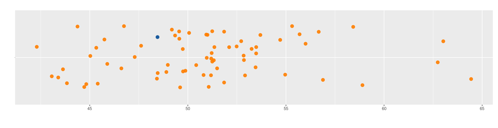
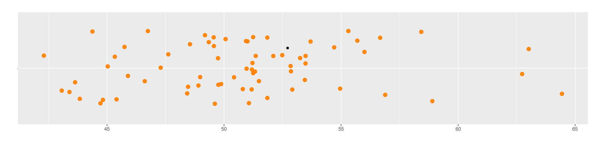
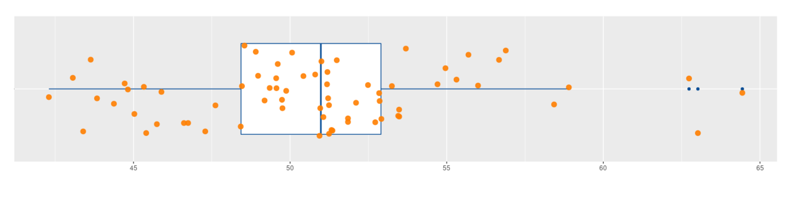

```{r setup, include=FALSE}
knitr::opts_chunk$set(echo = TRUE, comment = NA)

x=c(51.35212, 49.87575, 49.34843, 51.21381, 51.24443, 45.74725, 48.42380, 47.29197, 48.97805, 50.06414, 50.93887, 45.40615, 55.69387, 48.90457, 55.99991, 44.71925, 56.88540, 46.61125, 53.25002, 48.46261, 49.74167, 45.02893, 63.01846, 50.96321, 50.42523, 51.19170, 53.45167, 52.10473, 49.60598, 45.89307, 49.75569, 42.29984, 53.48346, 54.70581, 53.48042, 56.67013, 44.37571, 51.17919, 51.06382, 54.96013, 64.43723, 51.84813, 45.33205, 62.73598, 43.83679, 51.32204, 53.69599, 51.00030,
52.85885, 43.06412, 43.63493, 51.24188, 52.84303, 49.18509, 49.56495, 49.55592, 51.49034, 55.31177, 46.74424, 47.61693, 51.84773, 58.89864, 50.80074, 43.39416, 48.54392, 52.71874, 44.82219, 52.48635, 58.42706, 52.91451)

data1 <- data.frame(
  name1=rep("A",70),
  value1=x
)
```


Una de las dificultades que se presentan al tratar de interpretar los valores de una variables es el de poder la resumur en uno pocos indicadores que los represente, para lo cual es necesario utilizar indicadores que los caractericen. 


```{r, echo=FALSE, out.width="100%", fig.align = "center"}
knitr::include_graphics("img/puntos1.png")
```
<br/> <br/>


Para los datos cuantitativos se pueden utilizar las tablas de frecuencia identificando el valor que más se repite, indicador que se denomina **MODA**.

Para las variable cuantitativas existen una serie de indicadores que caracterisan y facilitan su analisis como son :

* Indicadores de posición
* Indicadores de centro
* Indicadores de dispersión o variabilidad
* Indicadores de forma

 <br/> <br/>
 
Iniciaremos con los **indicadores de posición**


```{r, echo=FALSE, out.width="70%", fig.align = "center"}

```
 <center> Tomada de : https://pixabay.com/ </center>
 
 <br/> <br/>
 
La posición final de un atleta en una competencia indica cual es su nivel frente a un grupo de competidores, de igual manera los indicadoreds de posición hacen referencia a la ubicación de un valor frente al grupo. Además del ganador y el último existen un gran número de valores intermedio que nos ayudan en el analisis de un grupo de datos

 <br/> <br/>
 
Los **PERCENTILES** corresponden a 99 valores que dividen los datos en  cien partes de igual porcentaje  ($P_{1}$, $P_{2}$, $P_{3}$, $P_{4}$, $\cdots$ ,$P_{99}$). 


<br/>

**Ejemplo 1** 

Los siguientes datos correspnde a tiempos registrados por 70 atletas  dutante una carrera de 10.5 kilómetros obtenidos de manera simulada que nos serviran de apoyo para visualizar y entender los indicadores de posición.


 <br/> <br/>

El **PERCENTIL 30** ($P_{30}$) divide la muestra en dos partes. Por debajo de este valor está el 30% de los datos y por encima de el esta el 70% restante. En este grupo de datos $P_{30} = 48.96$ y está representado por el punto nego 

```{r, echo=FALSE, out.width="700%", fig.align = "center"}

```
</br></br>

El **PERCENTIL 75** ($P_{75}$), está ubicado de tal forma en la muestra que  tiene por debajo un 75% de los datos y por encima  un 25%. Para este caso corresponde a $P_{75} = 52.90$, prepresentado en la siguiente gráfica por un punto nego 

```{r, echo=FALSE, out.width="700%", fig.align = "center"}

```


 <br/> <br/>

Tambien existen los **DECILES** que corresponden a  9 número que dividen la muestra en 10 partes, cada una con un 10% de la muestra ($D_{1}, D_{2}, D_{3}, D_{4}, \cdots , D_{9}$)

</br>

**Ejemplo 2**

+ El **DECIL  2** ($D_{2}$), tiene por debajo del el, el 20% de los datos 
+ El **DECIL 5** ($D_{5}$), por debajo de este número se encuentra el 50% de los datos

```{r, echo=FALSE, out.width="700%", fig.align = "center"}

```

En este caso corresponde a : $D_{2} = 46.72$  y $D_{5} = 50.98$ 


</br></br>

Y finalmente los **CUARTILES** que corresponden a 3 números que dividen la muestra en cuatro partes de igual porcentaje ($Q_{1}$, $Q_{2}$, $Q_{3}$), con los cuales se construye los diagrámas de cajas que permiten poder detectar datos atípicos

</br>

**Ejemplo 3**

</br>

```{r, echo=FALSE, out.width="700%", fig.align = "center"}

```


En este caso los cuartiles $Q_1 = 46.72$, $Q_2 = 50.98$ y $Q_3 = 52.90$, estan representados por las lineas verticales que conforman la caja. La linea central de la caja representa $Q_{2}$ que divide los datos en dos parte de igual porcentaje (50% - 50%). Los puntos azules ubicados a derecha del gráfico representan datos atípicos que deben ser objeto de estudio en unos casos y de exclusión en otros 

 <br/> <br/>
 
 **Código R**
 

Los percentiles pueden ser calculados mediante la función  `quantile()`

```{r}
x=c(51.35, 49.88, 49.35, 51.21, 51.24, 45.75, 48.42, 47.29, 48.98, 50.06, 50.94, 45.41, 55.69, 48.90, 56.00, 44.72, 56.89, 46.61, 53.25, 48.46, 49.74, 45.03, 63.02, 50.96, 50.43, 51.19, 53.45, 52.10, 49.61, 45.89, 49.76, 42.30, 53.48, 54.71, 53.48, 56.67, 44.38, 51.18, 51.06, 54.96, 64.44, 51.85, 45.33, 62.74, 43.84, 51.32, 53.70, 51.00, 52.86, 43.06, 43.63, 51.24, 52.84, 49.19, 49.56, 49.56, 51.49, 55.31, 46.74, 47.62, 51.85, 58.90, 50.80, 43.39, 48.54, 52.72, 44.82, 52.49, 58.43, 52.91)

sort(x)
```


```{r}
quantile(x, c(0.25,0.50,0.75))

```


