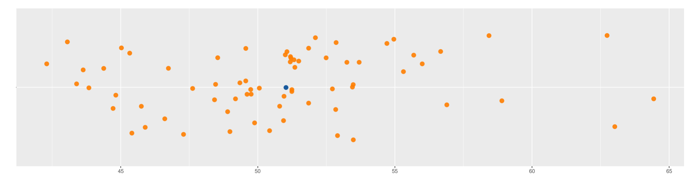

```{r setup, include=FALSE}
knitr::opts_chunk$set(echo = TRUE, comment = NA)

x=c(51.35, 49.88, 49.35, 51.21, 51.24, 45.75, 48.42, 47.29, 48.98, 50.06, 50.94, 45.41, 55.69, 48.90, 56.00, 44.72, 56.89, 46.61, 53.25, 48.46, 49.74, 45.03, 63.02, 50.96, 50.43, 51.19, 53.45, 52.10, 49.61, 45.89, 49.76, 42.30, 53.48, 54.71, 53.48, 56.67, 44.38, 51.18, 51.06, 54.96, 64.44, 51.85, 45.33, 62.74, 43.84, 51.32, 53.70, 51.00, 52.86, 43.06, 43.63, 51.24, 52.84, 49.19, 49.56, 49.56, 51.49, 55.31, 46.74, 47.62, 51.85, 58.90, 50.80, 43.39, 48.54, 52.72, 44.82, 52.49, 58.43, 52.91)
data1 <- data.frame(
  name1=rep("A",70),
  value1=x
)


```

```{r, echo=FALSE, out.width="100%", fig.align = "center"}
knitr::include_graphics("img/puntos1.png")


```

Uno de los principales retos en el análisis de datos consiste en resumir una información en unos pocos indicadores que los representen. Los indicadores de tendencia centro o de centro resumen en un número los datos. Dentro de ellos se destancan:

 <br/> <br/>
 
* Media
* Mediana
* Moda
* Rango medio
* Media truncada

 <br/> <br/>
 

### **Media aritmética** 

Es el indicador de tendencia central más conocido y utilizado por si fácil intepretación y calculo. Consiste en sumar todos los valores de un conjunto de datos y dividirlos por el número de datos

 <br/>
 
$$\bar{x}= \frac{1}{n} \sum_{i=1}^{n} x_{i}$$
 <br/>
 
Sus principales propiedades son:

+ La suma de las desviaciones de los datos con respecto a la media es cero. $\sum (x_{i}-\bar{x})=0$.

+ La suma de los cuadrados de las desviaciones de los datos con respecto a un valor $a$ es mínimo cuando $a=\bar{x}$.

+ Si $x_{i}=k$ para todo $i$, entonces, $\bar{x}=k$.

+ Si todos los datos de una variable se multiplican por una constante $k$, es decir $y_{i}=kx_{i}$, entonces $\bar{y}=k\bar{x}$

+ Si $z_{i}=a x_{i}+b y_{i}$, donde: **a**, **b** constantes y $x_{i}$, $y_{i}$ variables, entonces: $\bar{z}=a\bar{x}+b\bar{y}$. 

 <br/> <br/>
 

```{r, echo=FALSE, out.width="100%", fig.align = "center"}

```
</br></br>

Para el ejemplo simulado corresponde a  50.80 . En R se utuliza la función `mean(x)`


La media tiene un problema en presencia de datos atípicos y cuando los datos tienen formas asimétricas. Estos problemas los resuelve de manera robusta el siguiente indicador 

 <br/> <br/>

### **Mediana** 

**Me** :Es el número que divide la muestra en dos partes de igual proporción (50% : 50%). Es decir que corresponde al $P_{50}$ = $D_{5}$ = $Q_{2}$, revisado en los indicadores de posición e igual a 50.98.  En R se utiliza la función `median(x)`  

 <br/> <br/>
 

### **Moda** 

Para las variables cuantitativas se utiliza como indicador de centro la **MODA**, la cual corresponde al valor que más se repite o que mayor frecuencia tienen. Para encontrarla se construye una tabla de frecuencias


 <br/> <br/>
 
### **Media truncada**

Con el fin de evitar que los datos atípicos generen sesgos en el indicador de la media, es posible separar un gran porcentaje central de datos y cortar los datos de los extremos. Por ejemplo podemos truncar el 10% de los datos (5% a cada lado ) dejando un  90%.   A este indicador de le llama media truncada al 10%  ($\bar{x}_{_{0.10}}$)

Para el ejemplo simulado el valor de la media truncada corresponde a 50.53, calculado utilizando la función : `mean(x, na.rm = TRUE, trim = 0.10)`

 <br/> <br/>

 
### **Rango medio**  

El rango medio es un indicador fácil de calcular y muy practico para estimaciones rápidas. Para ello debemos conocer los valores mínomos y máximos de los datos, sumarlos y dividir el resultado por dos


$$\frac{1}{2}\Big(max(x)+min(x)\Big)$$
Para caluclarlo se puede puede construir la siguiente funcion en R : `(max(x ,na.rm = TRUE) + min(x,na.rm = TRUE))/2 `, la cual arroja un valor de 53.37 para los datos simulados


**Códigos R**

```{r, eval=FALSE}
x=c(51.35, 49.88, 49.35, 51.21, 51.24, 45.75, 48.42, 47.29, 48.98, 50.06, 50.94, 45.41, 55.69, 48.90, 56.00, 44.72, 56.89, 46.61, 53.25, 48.46, 49.74, 45.03, 63.02, 50.96, 50.43, 51.19, 53.45, 52.10, 49.61, 45.89, 49.76, 42.30, 53.48, 54.71, 53.48, 56.67, 44.38, 51.18, 51.06, 54.96, 64.44, 51.85, 45.33, 62.74, 43.84, 51.32, 53.70, 51.00, 52.86, 43.06, 43.63, 51.24, 52.84, 49.19, 49.56, 49.56, 51.49, 55.31, 46.74, 47.62, 51.85, 58.90, 50.80, 43.39, 48.54, 52.72, 44.82, 52.49, 58.43, 52.91)


mean(x)                                           # media
median(x)                                         # mediana 
mean(x, na.rm = TRUE, trim = 0.10)                # media truncada al 10%
(max(x ,na.rm = TRUE) + min(x,na.rm = TRUE))/2    # rango medio 
```


