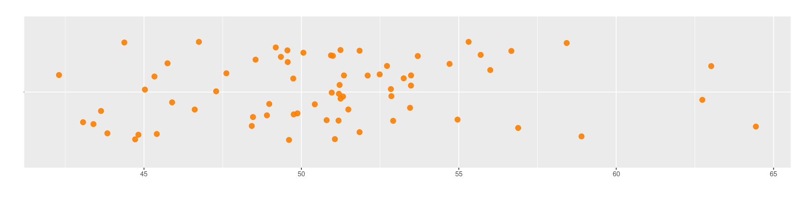

```{r setup, include=FALSE}
knitr::opts_chunk$set(echo = TRUE, comment = NA)

x=c(51.35, 49.88, 49.35, 51.21, 51.24, 45.75, 48.42, 47.29, 48.98, 50.06, 50.94, 45.41, 55.69, 48.90, 56.00, 44.72, 56.89, 46.61, 53.25, 48.46, 49.74, 45.03, 63.02, 50.96, 50.43, 51.19, 53.45, 52.10, 49.61, 45.89, 49.76, 42.30, 53.48, 54.71, 53.48, 56.67, 44.38, 51.18, 51.06, 54.96, 64.44, 51.85, 45.33, 62.74, 43.84, 51.32, 53.70, 51.00, 52.86, 43.06, 43.63, 51.24, 52.84, 49.19, 49.56, 49.56, 51.49, 55.31, 46.74, 47.62, 51.85, 58.90, 50.80, 43.39, 48.54, 52.72, 44.82, 52.49, 58.43, 52.91)

data1 <- data.frame(
  name1=rep("A",70),
  value1=x
)
```

```{r, echo=FALSE, out.width="100%", fig.align = "center"}

```


 <br/> <br/>
 
Una de las caracteristicas principales estan constituido por los indicadores de centro, dentro de ellos se destacan :

* Media
* Mediana
* Moda
* Rango medio
* Media truncada
* Media geométrica
* Media armónica

 <br/> <br/>
 
### **Media aritmética** 

Es el indicador de tendencia central más conocido y utilizado por si fácil intepretación y calculo. Consiste en sumar todos los valores de un conjunto de datos y dividirlos por el número de datos

 <br/>
 
$$\bar{x}= \frac{1}{n} \sum_{i=1}^{n} x_{i}$$

```{r, eval=FALSE}
x=c(1,2,3,4,5,6,7,8,9,10) # vector de numeros
mean(x)  # funcion media
sum(x)/length(x) # calculo de la media
```

<pre class="my-pre">
[1]  5.5
</pre>

 <br/>
 
Sus principales propiedades son:

+ La suma de las desviaciones de los datos con respecto a la media es cero. $\sum (x_{i}-\bar{x})=0$.

+ La suma de los cuadrados de las desviaciones de los datos con respecto a un valor $a$ es mínimo cuando $a=\bar{x}$.

+ Si $x_{i}=k$ para todo $i$, entonces, $\bar{x}=k$.

+ Si todos los datos de una variable se multiplican por una constante $k$, es decir $y_{i}=kx_{i}$, entonces $\bar{y}=k\bar{x}$

+ Si $z_{i}=a x_{i}+b y_{i}$, donde: **a**, **b** constantes y $x_{i}$, $y_{i}$ variables, entonces: $\bar{z}=a\bar{x}+b\bar{y}$. 

 <br/> <br/>
 
**Ejemplo 1**

<br/>

El promedio de el rendimiento de millas por galón de combustible del grupo de 32 autos observados en el dataset `mtcars` es de $20.09$ mpg


```{r, eval=FALSE}
mean(mtcars$mpg,     # variable mpg de la data mtcars
     na.rm = TRUE)   # parametro util cuando se tiene datos faltantes :
```

<pre class="my-pre">
[1]  20.09062     
</pre>

<br/> <br/>

### **Mediana** 

<br/>

**Me** :Es el número que divide la muestra en dos partes de igual proporción (50% : 50%). Es decir que corresponde a:

+ $P_{50}$ : percentil 50
+ $D_{5}$ : decil 5
+ $Q_{2}$ : segundo cuartil

 <br/> <br/>
 
**Ejemplo 2**

<br/>

```{r, eval=FALSE}
median(cars$speed)
```

<pre class="my-pre">
[1] 15
</pre>

 <br/> <br/>

### **Moda**  

<br/>

**Mo** : Dato o valor que más se repite. Es utilizada como medida de tendencia central en variables cualitativas o o en cuantitativas discretas con pocos valores. En una tabla o  gráfico se puede distinguir fácilmente.

<br/> <br/>
 
**Ejemplo 3**

 <br/> <br/>
 
### **Media truncada**

<br/>

Con el fin de evitar que los datos atípicos generen sesgos en el indicador de la media, es posible separar el 90% de los datos, quitando un 5% de los datos mas pequeños y un  5% de los datos mayores. A este indicador de le llama media truncada al 10%  ($\bar{x}_{_{0.10}}$)

 <br/> <br/>
 

```{r, eval=FALSE}
mean(mtcars$mpg, na.rm = TRUE, trim = 0.10)
```

<pre class="my-pre">
[1] 19.69615
</pre>

 <br/> <br/>
 
### **Rango medio**  

<br/>

$$\frac{1}{2}\big(max(x)+min(x)\big)$$


```{r, eval=FALSE}
(max(mtcars$mpg,na.rm = TRUE)+min(mtcars$mpg,na.rm = TRUE))/2
```

<pre class="my-pre">
[1] 22.15
</pre>

La diferencia entre el equipo con mas poder ofencivo y el equipo como menor valor es de 1.87 puntos. 

<br/> <br/>

###  **Media geométrica** 

<br/>

Este indicador de tendencia central se utiliza para promediar tasa de crecimiento o de interés. Para encontrar su valor se multiplican los valores de $n$ tasas incrementadas en uno ($1+r$). A ese producto se le extrae la raíz n-esima.

$$MG = \Bigg(\displaystyle\prod_{i=1}^n (r_{i}+1)\Bigg)^{1/n}$$

 <br/> <br/>
 
**Ejemplo 3**

<br/>

El crecimiento de la población en Colombia durante las ultimas decadas presenta la siguiente tendencia :


```{r, eval=FALSE}
# install.packages(psych)
library(psych)
x = c(0.025,0.022,0.02,0.016,0.011,0.007)

psych::geometric.mean(x)
```

<pre class="my-pre">
[1] 0.01544071
</pre>

<br/>

Lo  cual indica que a población colombiana está creciendo a una tasa del 1.5% durante las últimas 5 decadas

 <br/> <br/>
 
###  **Media armónica**  

$$H = \dfrac{1}{\frac{1}{x_{1}}+\frac{1}{x_{2}}+ ... + \frac{1}{x_{n}}}$$

Este indicador corresponde al inverso de la media aritmética, se utiliza para el calculo de velocidades medias, tiempos especialmente en el area de la electrónica. 

<br/><br/>

**Ejemplo 4**

<br/>

Una empresa de transporte desea estimar la media de tiempo que se pueden tardar sus autos en un viaje de una ciudad A a una ciudad B. Para haciona el tiempo empleado por un grupo de 3 de sus vehiculos. Los tiempos registrados con respectivamente son 4.25, 3.75 y 5.25 horas ( tiempos equivalentes en escala decimal)

Para calcular la velocidad promedio utilizamos la media armónica tenemos:


```{r, eval=FALSE}
library(psych)
x=c(4.25, 3.75, 5.25)
harmonic.mean(x,na.rm=TRUE,zero=TRUE)
```

<pre class="my-pre">
[1] 4.332524
</pre>


