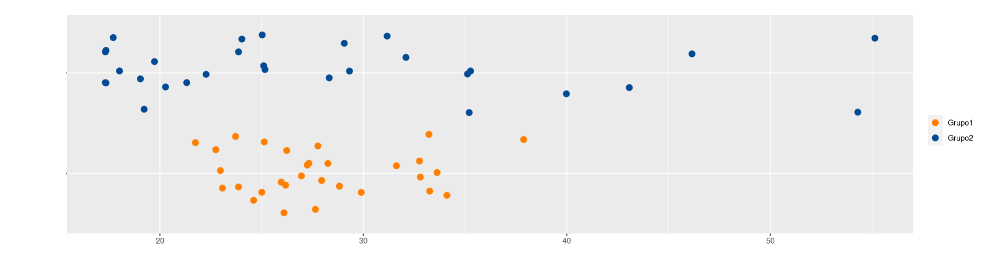

```{r setup, include=FALSE}
knitr::opts_chunk$set(echo = TRUE, comment = NA)

x1=c(27, 27, 28, 28, 34, 28, 26, 33, 24, 28, 25, 25, 33, 27, 34, 38, 24, 26, 22, 23, 33, 23, 26, 26, 32, 33, 29, 30, 25, 23)
x2=c(35,  25,  19,  17,  24,   17,  55,  25,  31,   35,  43,  28,  32,  19,  20, 17, 25,  18,  21,  22,  17,  35,  29,  20,  54,  46,  24, 29, 40, 18)
data4=data.frame(x1,x2)
```


## **Problema reconocimiento de grupo**

</br>

Supongamos que tenemos dos grupos de estudiantes y que solo se conoce  ambos grupos tienen en promedio  28 años de edad.  Lo que primero se piensa es que los dos grupos tienen una composición igual o muy parecida dado que coinciden en su promedio.  Pero no es así, los datos que se presentan a continuación tienen medias de 28,  pero corresponden a grupos diferentes.

|           |                                                                                                                       |
|:----------|:----------------------------------------------------------------------------------------------------------------------|
| Grupo 1   |27, 27, 28, 28, 34, 28, 26, 33, 24, 28, 25, 25, 33, 27, 34, 38, 24, 26, 22, 23, 33, 23, 26, 26, 32, 33, 29, 30, 25, 23 | 
| Grupo 2   |35, 25, 19, 17, 24, 17, 55, 25, 31, 35, 43, 28, 32, 19, 20, 17, 25, 18, 21, 22, 17, 35, 29, 20, 54, 46, 24, 29, 40, 18 |

</br></br>

```{r, echo=FALSE, out.width="100%", fig.align = "center"}

```

</br></br>

Hace falta otro indicador que nos oriente sobre  que tan dispersos son los datos con el fin de saber si se trata de grupos parecidos tanto en centro como en variabilidad. Esta necesidad la suplen los `indicadores de dispersión`.

<br/> <br/>

## **Indicadores de Dispersión**

</br>

### **Rango**

</br>

El rango es el indicador de dispersión más facil de calcular, pues se obtiene restando los valores extremos de los datos: 

$r = max(x) - min(x)$

En caso de los dos grupos:

|**Grupo 1**                  | **Grupo 1**                        |
|:----------------------------|:-----------------------------------|
|$\bar{x} = 28$ años          |$\bar{x} = 28$ años                 |
|$r = 16$ años                 |$r = 38$ años                      |  
|                             |                                    |

</br>

Es importante hacer notar que si además de la media conocemos también un indicador de dispersión, en este caso el rango, podemos caracterizar un poco más a los grupos. El rango es un indicador muy útil cuando se deben realizar cálculos rápidos.

<br/> <br/>

### **Varianza**

</br>

Es la medida de dispersión más utilizada en estadística y está definida por :

$$s^{2}=\frac{1}{n-1} \sum_{i=1}^{n} (x_{i}-\bar{x})^{2}$$


Se podría afirmar que la varianza es un promedio de los cuadrados de las diferencias entre los datos  y su media

<br/> <br/>

#### **Propiedades de la varianza**

+ $s^{2} = \frac{1}{n} \sum x_{i}^{2}- (\bar{x})^{2}$ 

+ La varianza es siempre no negativa  $s^{2} >=0$

+ La varianza de una constante es cero $s_{k}^{2}=0$

+ Si $y_{i}=k x_{i}$, entonces $s_{y}^{2}= k^{2} s_{x}^{2}$

+ Si $y_{i}=x_{i} + k$ , entonces  $s_{y}^{2} = s_{x}^{2}$

+ Si $z_{i} = a x_{i} + b y_{i}$, entonces $s_{z}^{2}$ = $a^{2}s_{x}^{2}$ + $b^{2}s_{y}^{2}$ + $2ab$ $cov(xy)$

</br></br>

El problema de la varianza es su **interpretación**, pues sus unidades quedan al cuadrado y en la mayoría de los casos no es posible interpretar los resultados. Por esta razón se optó por utilizar otra mediada de dispersión calculada a partir de la raíz cuadrada de la varianza.

<br/> <br/>

### **Desviación estándar** 

</br>

Es la raíz cuadrada de la varianza

$$s=\sqrt{s^{2}}$$

**Nota** : no aplican todas las propiedades de la varianza

</br>

|**Grupo 1**                  | **Grupo 1**                        |
|:----------------------------|:-----------------------------------|
|$\bar{x} = 28$ años          |$\bar{x} = 28$ años                 |
|$s^{2} = 16.62$ años$^2$     |$s^{2} = 116.89$ años$^2$           |  
|$s  = 4.16$ años             |$s = 10.81$ años                    | 

</br>

Aunque la desviación estándar reduce el problema mencionado anteriormente debido a tener las mismas unidades de la variable, es útil para comparación de dos grupos con igual media.  En caso de que las medias sean diferentes es difícil poder realizar las comparaciones.

<br/> <br/>

### **Coeficiente de variación**

</br>

Por último, el coeficiente de variación es un indicador adimensional que indica que tan grande o que tan pequeña es la desviación estándar con respecto a su media en porcentaje y de esta manera podemos resolver el problema de la dispersión para cualquier grupo de datos

$$CV= \dfrac{s}{\bar{x}} \times 100 \% $$

Existen diferentes reglas empíricas para la interpretación del coeficiente de variación. Una de ellas establece como límite el 20% para separar los grupos homogéneos de los heterogéneos Por lo general se utiliza un valor hasta el 20% para determinar que un grupo de datos son homogéneos, de lo contrario se calificará como heterogéneo.

</br>

|**Grupo 1**                  | **Grupo 1**                        |
|:----------------------------|:-----------------------------------|
|$\bar{x} = 28$ años          |$\bar{x} = 28$ años                 |
|$CV  = 14.56$ %              |$CV = 38.61$ %                      |  

</br>

En este caso se obtienen valores diferentes para los dos grupos. El grupo 1 con un valor inferior a 20%, que indica homogeneidad y el grupo 2 con un valor superior que indica heterogeneidad

</br></br></br>

### **Códigos R**


```{r, eval=FALSE}
max(x1)-min(x1)        # rango
var(x1)                # varianza
sd(x1)                 # desviación estándar
sd(x1)/mean(x1)*100    # coeficiente de variación
```

<pre class="my-pre">
[1] 16
[1] 16.62069
[1] 4.076848
[1] 14.56017  
</pre> 


