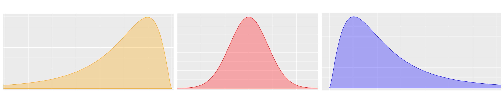

```{r setup, include=FALSE}
knitr::opts_chunk$set(echo = TRUE, comment = NA)

x=c(51.35, 49.88, 49.35, 51.21, 51.24, 45.75, 48.42, 47.29, 48.98, 50.06, 50.94, 45.41, 55.69, 48.90, 56.00, 44.72, 56.89, 46.61, 53.25, 48.46, 49.74, 45.03, 63.02, 50.96, 50.43, 51.19, 53.45, 52.10, 49.61, 45.89, 49.76, 42.30, 53.48, 54.71, 53.48, 56.67, 44.38, 51.18, 51.06, 54.96, 64.44, 51.85, 45.33, 62.74, 43.84, 51.32, 53.70, 51.00, 52.86, 43.06, 43.63, 51.24, 52.84, 49.19, 49.56, 49.56, 51.49, 55.31, 46.74, 47.62, 51.85, 58.90, 50.80, 43.39, 48.54, 52.72, 44.82, 52.49, 58.43, 52.91)
data1 <- data.frame(
name1=rep("A",70),
value1=x
)

c1="#FF7F00"
c2="#=EB0C6"
c3="#034A94"
c4="#686868"


library(ggplot2)
```

Los indicadores de forma permiten adicionar elementos a la interpretación de los datos.

<br/><br/>

### **Curtosis**

<br/>

Se mide a través del coeficiente de curtosis que mide cuan **puntiaguda** es una distribución respecto a un patrón estándar que es la curva de la distribución normal. Esta característica está relacionada directamente con la dispersión

De acuerdo con su valor, la puntudez de los datos puede clasificarse en tres grupos:

+ **Leptocúrtica**, con valores grandes para el coeficiente (CA>0)

+ **Mesocúrtica**, con valores medianos para el coeficiente (CA=0)

+ **Platicútrica**, con valores pequeños para el coeficiente (CA<0) 

</br>

```{r, echo=FALSE, fig.height=3, fig.width=9}
# Distribucion normal
library(ggfortify)
p=ggdistribution(dnorm, seq(-5, 5, 0.01), mean = 0, sd = 1,colour = 'blue')
p=ggdistribution(dnorm, seq(-5, 5, 0.01), mean = 0, sd = .7,colour = 'red', p=p)
p=ggdistribution(dnorm, seq(-5, 5, 0.01),   mean = 0, sd = 1.5,colour = 'orange', p=p)
p
```

<br/> <br/>

En R se utiliza la función del paquete rapportools : `rapportools::kurtosis(x)` 


<br/><br/> 

### **Asimetría o sesgo**

<br/>

Mide que tanto la forma de la distribución de frecuencias de los datos es simétrica o no con respecto a la media. Esta característica de los datos se mide a través del coeficiente de asimetría o sesgo.

+ Es **simétrica** si el  valor del indicador es 0  ($\bar{x}=Me$)

+ Es **asimétrica a la izquierda**> si el valor del indicador es negativo ($\bar{x}<Me$)

+ Es **asimétrica a la derecha** si el valor del indicador es positivo ($\bar{x}>Me$)

<br/>



<br/>

#### **Interpretación**

<br/>

+ **Asimetría negativa ** : poco con poco y mucho con mucho.  Una prueba con resultados asimétricos a la izquierda o negativa, indica que pocos obtuvieron resultados bajos y que muchos alcanzaron resultados altos, pudiendo indicar que la prueba era relativamente fácil

+ **Simétrica**           : poco con poco, poco con mucho, mucho al rededor de un centro. En este caso una prueba con resultados simétricos indica que los puntajes se ubicaron al rededor de la media y que unos pocos sacaron puntaje bajo y que los que presentaron resultados altos corresponden a un pequeño grupo. Por lo regular estos son los resultados de pruebas estandarizada como pueden ser las pruebas de estado.

+ **Asimetría positiva**  : mucho con poco y poco con mucho. Los resultados a pruebas con asimetría a la derecha o positiva, presentan resultados acumulados a la izquierda, es decir que muchos obtuvieron resultados bajos y unos pocos resultados altos. Esto haría pensar que la prueba fue exigente.

<br/><br/>

### **Código R**

<br/>

En R se utiliza la funciones : `rapportools::kurtosis(x)`  y  `rapportools::skewness(x)` de manera individual.

</br>

```{r, eval=FALSE}
x=c(51.35, 49.88, 49.35, 51.21, 51.24, 45.75, 48.42, 47.29, 48.98, 50.06, 50.94, 45.41, 55.69,  48.90, 56.00, 44.72, 56.89, 46.61, 53.25, 48.46, 49.74, 45.03, 63.02, 50.96, 50.43, 51.19, 53.45, 52.10, 49.61, 45.89, 49.76, 42.30, 53.48, 54.71, 53.48, 56.67, 44.38, 51.18, 51.06, 54.96, 64.44, 51.85, 45.33, 62.74, 43.84, 51.32, 53.70, 51.00, 52.86, 43.06, 43.63, 51.24, 52.84, 49.19, 49.56, 49.56, 51.49, 55.31, 46.74, 47.62, 51.85, 58.90, 50.80, 43.39, 48.54, 52.72, 44.82, 52.49, 58.43, 52.91)

rapportools::kurtosis(x)   
rapportools::skewness(x)   
```

<pre class="my-pre">
[1] 0.6423682
[1] 0.6014827
</pre>

</pre>

Estos resultados indica una leve concentración de los datos y una leve asimetría a la derecha, la cual será mas evidente observar en la siguiente sección (Representación gráfica)

<br/>

El valor obtenido para el sesgos nos indica que existe un mediano sesgo positivo o a la derecha ( mucho con poco - poco con mucho). 