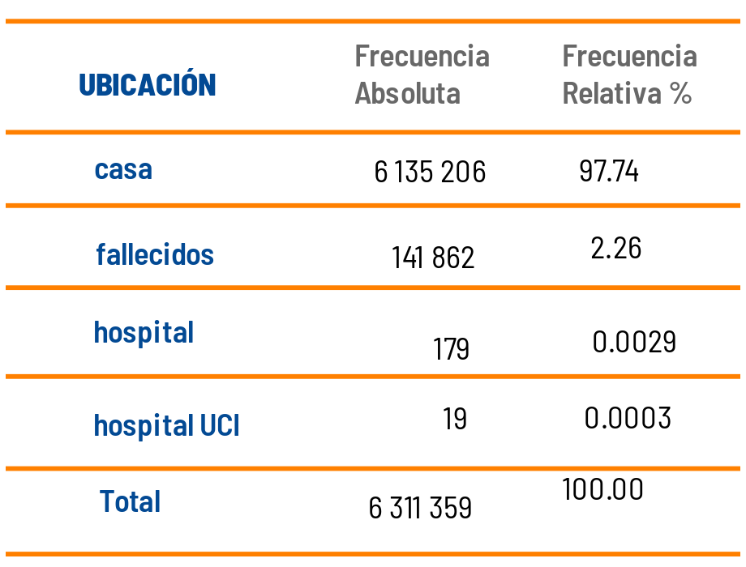

```{r setup, include=FALSE}
knitr::opts_chunk$set(echo = TRUE, comment = NA)
Colombia<-readRDS("/home/deg/Documentos/Javeriana/Ms en Ciencia de Datos/repository/dataset/Colombia.RDS")
```

</br>


Las tablas de frecuencia constituyen una de las herramientas más utilizadas en Estadística para resumir variables de tipo cualitativas.  Para las variables en escala nominal estan conformadas por tres columnas : 

+ Descripción que corresponde a los niveles o valores diferentes que posee la variable
+ Frecuencia absoluta o conteo de los elementos o registros que tienen un valor determinado
+ Freciemcoa relativa que coresponde al porcentaje sobre el total de registros que corresponden a un valor determinado

La siguiente tabla corresponde a la distribución de la variable ubicación de las personas que se han contagiado con Covid-19 en Colombia, base que se encuentra disponible en la plataforma [DATOS ABIERTOS](https://www.datos.gov.co/browse?q=covid%20&sortBy=relevance)


```{r, echo=FALSE, out.width="50%", fig.align = "center"}

```
Fuente : Base Casos positivos de COVID-19 en Colombia. 17-10-2022

La tabla permite visualizar que actualmente están reportados 19 casos en cuidado UCI y que a la fecha han fallecido en Colombia a causa del Covid-19 141862 personas


Las tablas de frecuencia además de permitir un analisis rapido de las variables cualitativas, tambien permite detectar posible problemas en la digitación y valorar la magnitud de los datos faltantes (NA) 

</br></br>

Como ejemplo tenemos las variables ubicación (Colombia\$ubucacion) y sexo (Colombia\$sexo)  

```{r}
table(Colombia$ubicacion)
```

</br>

```{r}
table(Colombia$sexo)
```

</br>

Es necesario corregir esto problemas antes de procesar la información. La funcion de R `str_to_lower()` del paquete `stringr` lo hace.

```{r}
library(stringr)
Colombia$ubicacionA <- str_to_lower(Colombia$ubicacion) # pasar a minusculas todos valores 
Colombia$ubicacionA[Colombia$ubicacionA=="n/a"]=NA   # cambiar el valor  n/a por NA - valores faltantes

Colombia$sexoA <- str_to_lower(Colombia$sexo) # pasar a minusculas todos valores 
Colombia$sexoA[Colombia$sexoA=="n/a"]=NA   # cambiar el valor  n/a por NA - valores faltantes

table(Colombia$ubicacionA)
table(Colombia$sexoA)

```
</br></br>

Además de los problemas detectados la información resumida permite 

</br></br>

Tambien es posible realizar una tabla cruzada a partir de dos variables cualitativas en este caso de escala nominal

```{r, echo=FALSE}
table(Colombia$ubicacionA, Colombia$sexoA)
```

</br></br>


La información anterior corresponde a distribuciones de frecuencia absolutas que se expresan en termino de número de personas, pero tambien es importante realizar el analisis en porcentaje dado que puede dar una idea de lo que representa una categoria en relación con el total en este caso  de positivos de Covid-19


```{r}
t=round(table(Colombia$ubicacionA, Colombia$sexoA)*100, 2)
t/sum(t)
```

</br>


Una mejor representación se puede realizar a traves de la funcion `freq` del  paquete `summarytools`


```{r, eval=FALSE, echo=FALSE}
install.packages("remotes")        # se puede tambien utulizar el paquete devtools
library(remotes)
install_github("dcomtois/summarytools", build_vignettes = TRUE) # descarga paquete summarytools
```


</br></br>

```{r, echo=FALSE}
summarytools::freq(Colombia$ubicacionA, cumul = FALSE)
```

En este caso pordemos decir que los fallecidos en Colombia corresponden al  2.24% del total de infectados

</br></br>

```{r, echo=FALSE}
ev=c("1-Muy regular", "2-Regular", "3-Bueno", "4-Muy bueno","5-Excelente")
califica=sample(ev, 1000, replace = TRUE, prob = c(0.04,0.08,0.12,0.43,0.32))
summarytools::freq(califica)
```


Note que en este caso se genera una columna adicional que corresponde a la frecuencia acumulada, que en este caso tiene sentido dado que la variable tiene una escala ordinal


