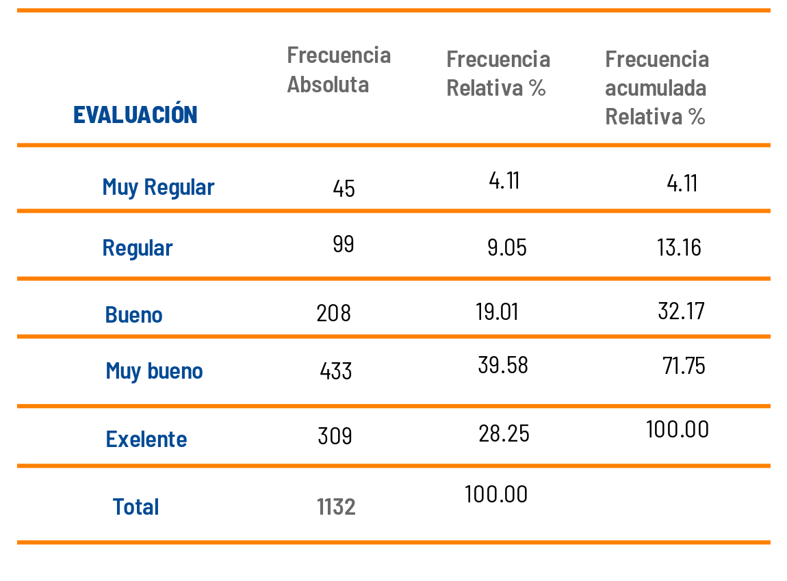

```{r setup, include=FALSE}
knitr::opts_chunk$set(echo = TRUE, comment = NA)
Colombia<-readRDS("/home/deg/Documentos/Javeriana/Ms en Ciencia de Datos/repository/dataset/Colombia.RDS")
```

</br>


### **Tablas de frecuencia variables nominales**

</br>

Las tablas de frecuencia constituyen una de las herramientas más utilizadas en Estadística para resumir variables de tipo cualitativas.  Para las variables en **escala nominal** estan conformadas por tres columnas : 

+ Descripción que corresponde a los niveles o valores diferentes que posee la variable
+ Frecuencia absoluta o conteo de los elementos o registros que tienen un valor determinado
+ Freciemcoa relativa que coresponde al porcentaje sobre el total de registros que corresponden a un valor determinado

La siguiente tabla corresponde a la distribución de la variable ubicación de las personas que se han contagiado con Covid-19 en Colombia, base que se encuentra disponible en la plataforma [DATOS ABIERTOS](https://www.datos.gov.co/browse?q=covid%20&sortBy=relevance)

</br></br>
<center>**DISTRIBUCIÓN DE LA UBICACIÓN DE CONTAGIADOS DE COVID-19 COLOMBIA**</center>
```{r, echo=FALSE, out.width="45%", fig.align = "center"}
knitr::include_graphics("img/tabla1.png")
```
<center>Fuente : Base Casos positivos de COVID-19 en Colombia. 17-10-2022</center>

</br>

La tabla permite visualizar que actualmente están reportados 19 casos en cuidado UCI y que a la fecha han fallecido en Colombia a causa del Covid-19 141862 personas


</br></br>

### **Tablas de frecuencia variables ordinales**

</br>

Para el caso de variables cualitativas medidas en **escala ordinal** los valores debe presentarse ordenados. En este caso se adiciona una columna donde aparecen las frecuencias acumuladas relativas

</br></br>

<center>**EVALUACIÓN DEL SERVICIO DE ATENCIÓN AL CLIENTE MES DE NOVIEMBRE DE 2022**</center>
```{r, echo=FALSE, out.width="60%", fig.align = "center"}

```

</br></br>

### **Tablas cruzadas**

</br>

Se puede interpretar que las evaluaciones desfavorables (muy regular y regular) representan un 13.16%  y que entre muy bueno y exelente se encuentra el 67.83% de los evaluados (100-32.17)


Tambien es de utilidad realizar tablas cruzadas o de doble entrada que permite visualizar las frecuencias de dos variables cualitativas 

</br></br>
<center>**DISTRIBUCIÓN DE LA UBUCACION POR SEXO DE LOS CONTAGIADOS DE COVID-19 COLOMBIA**</center>
```{r, echo=FALSE, out.width="60%", fig.align = "center"}
knitr::include_graphics("img/tabla3.png")
```
<center>Fuente : Base Casos positivos de COVID-19 en Colombia. 17-10-2022</center>

</br></br>

De esta tabla se puede observar que se presenta una mayor cantidad de hombres fallecidos  (86045)

</br></br>

### **Visualización de errores**

</br>

Las tablas de frecuencia además de permitir un analisis rapido de las variables cualitativas, tambien permite detectar posible problemas en la digitación y valorar la magnitud de los datos faltantes (NA) 

</br></br>

Como ejemplo tenemos las variables ubicación (Colombia\$ubucacion) y sexo (Colombia\$sexo)  

| casa    | Casa       |CASA    |Fallecido     |Hospital        | Hospital UCI  | NA      |
|:--------|:-----------|:-------|:-------------|:---------------|:--------------|:--------|
| 27689   | 6107510    |7       |141862        |   179          | 19            | 34093   |


</br></br>

|   f  | F         | m      | M        |
|:-----|:----------|:-------|:---------|
|   6  |3370605    |6       | 2940742  |


</br></br>

En R se puede utilizar la función `table(x)` para la elaboración de una tabla de frecuencias que contiene solo el conteo, pero que permite una revición rapida de sus valores. Una mejor representación se puede realizar a traves de la función `freq` del  paquete `summarytools`

</br></br>

### **Código R**


</br>

El siguiente código de R permite descargar la base de datos Casos positivos de COVID-19 en Colombia directamente del portal de Datos Abiertos, revisar los valores de las variables : ubicación y sexo, arreglarlas pasando todos sus valores a minúsculas y corrigiendo el valor de los datos faltantes NA


```{r, eval=FALSE}
install.packages("tidyverse") #  instalacion de paquete para manejo de datos
library(tidyverse)   # libreria de librerias util en el manejo de datos

install.packages("RSocrata", dependencies = TRUE)   # instalación de paquete RSocrata
library(RSocrata)    # llamado de libreria
token <- "zxMsD6eXc0zlEMryRGW87Hwrz"  # token
Colombia <- read.socrata("https://www.datos.gov.co/resource/gt2j-8ykr.json", app_token = token) # lectura de manera remota 

# adecuación de la base de datos
Colombia$edad=as.integer(Colombia$edad)  # convertir en entoro la variable edad
Colombia$sexo=str_to_lower(Colombia$sexo) # pasar a minusculas todos valores de la variable sexo
Colombia$estado=str_to_lower(Colombia$estado) # pasar a minusculas todos lo valores de la variable estado
Colombia$estado[Colombia$estado=="n/a"]=NA   # cambiar el valor  n/a por NA - valores faltantes
Colombia$recuperado=str_to_lower(Colombia$recuperado) # pasar a minusculas todos los valores de la variable recuperado
Colombia$recuperado[Colombia$recuperado=="n/a"]=NA 

# seleccion de bases
Colombia22=subset(Colombia, Colombia$fecha_reporte_web>="2022-01-01") # data del 2022
Colombia21=subset(Colombia, Colombia$fecha_reporte_web>="2021-01-01" & Colombia$fecha_reporte_web<"2022-01-01") # data de 2021
Colombia20=subset(Colombia, Colombia$fecha_reporte_web>="2020-01-01" & Colombia$fecha_reporte_web<"2021-01-01") # data de 2020
Colombia22_09=subset(Colombia, Colombia$fecha_reporte_web>="2022-09-01") # data de 2022 sep


Valle22=subset(Colombia22, departamento=="76") # data del valle del cauca de 2022
Cali22_09= subset(Colombia22_09, ciudad_municipio_nom=="CALI") # data de cali de 2022

table(Colombia22$estado)
table(Colombia21$estado)
table(Colombia20$estado)

summarytools::freq(Colombia22$estado, cumul = F)
summarytools::freq(Colombia21$estado, cumul = F)
summarytools::freq(Colombia20$estado, cumul = F)
summarytools::descr(Colombia22$edad)

saveRDS(Colombia, file = "data/Colombia.RDS")  # guardar base con modificaciones

table(Cali22_06$estado)
```

</br></br>

Tabla de frecuencias de una variable cualitativa en escala nominal

```{r, eval=FALSE}
summarytools::freq(Colombia$ubicacion, cumul = FALSE)    # tabla
```

</br></br>

Tabla de frecuencias de una variable cuantitativa en escala ordinal

```{r, eval=FALSE}
ev=c("1-Muy regular", "2-Regular", "3-Bueno", "4-Muy bueno","5-Excelente")     # etiquetas 
califica=sample(ev, 1000, replace = TRUE, prob = c(0.04,0.08,0.12,0.43,0.32))  # datos simulados
summarytools::freq(califica)                                                   # tabla   
```


